# CriptoSV---Samsung

En junio de 2021, El Salvador se convirtió en el primer país en adoptar Bitcoin como moneda de curso legal. Este proyecto tiene como objetivo analizar y evaluar si esta decisión ha tenido un impacto significativo en la macroeconomía salvadoreña.

Para ello, hemos recopilado y comparado datos históricos de variables económicas clave, como el Producto Interno Bruto (PIB), el Índice de Precios al Consumidor (IPC), la deuda externa pública, las reservas de divisas, y la inversión, con el precio histórico del Bitcoin. Utilizamos técnicas de análisis de datos para explorar correlaciones y patrones entre estas variables, buscando evidencia sobre cómo la adopción del Bitcoin ha influido en la economía del país.

Este análisis proporciona una base para comprender los posibles efectos de la implementación del Bitcoin en la economía salvadoreña y contribuye al debate sobre la influencia del uso de criptomonedas en contextos macroeconómicos.

## Tabla de contenidos

1. [Arquitectura](#Arquitectura)
2. [Proceso](#Proceso)
3. [Funcionalidades](#Funcionalidades)
4. [Estado del proyecto](#EstadoDelProyecto)
5. [Agradecimientos](#Agradecimientos)

## Arquitectura del proyecto

Nuestro proyecto corre en un kernel de python, haciendo uso de diferentes librerias tales como:

- pandas
- matplotlib
- seaborn
- statsmodels
- scipy

y todo esto sobre un documento de jupyter notebook, con datos traídos de la web.

Finalmente, alojamos nuestro repositorio en Github
 
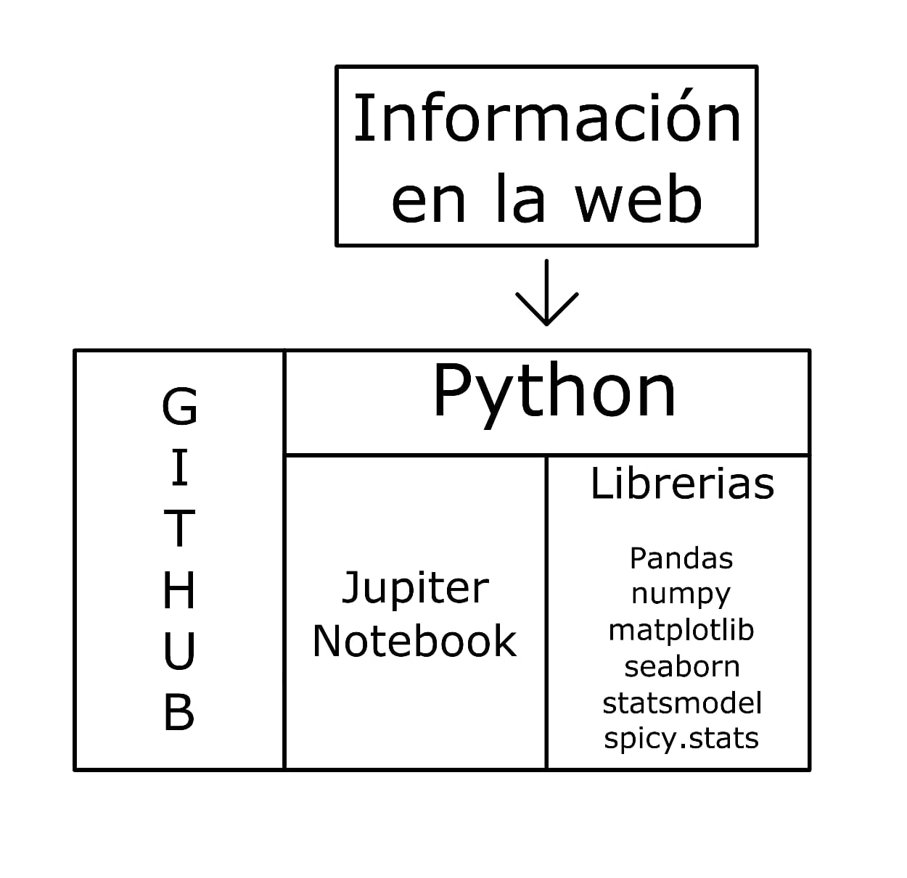

## Proceso de desarrollo:

- Fuentes de datasets

     A continuación, una lista de los enlaces a los diferentes datasets utilizados:   

    - [Deuda pública](https://estadisticas.bcr.gob.sv/serie/deuda-publica-total-anual)
    - [Precio histórico del bitcoin](https://www.kaggle.com/datasets/shiivvvaam/bitcoin-historical-data)
    - [Posición de inversión internacional](https://estadisticas.bcr.gob.sv/serie/ii-7a-posicion-de-inversion-internacional)
    - [Índice de precios al consumidor](https://estadisticas.bcr.gob.sv/serie/indice-de-precios-al-consumidor-ipc)
    - [Producto interno bruto](https://estadisticas.bcr.gob.sv/serie/producto-interno-bruto-produccion-gasto-e-ingreso-a-precios-corrientes)
    - [Reservas internacionales netas](https://estadisticas.bcr.gob.sv/serie/reservas-internacionales-netas-bcr)
     

- Fusión de todos los datasets en un DataFrame

     En un inicio, todos los dataset estaban separados en distintos daraframes, entonces lo fusionamos en uno solo:  

    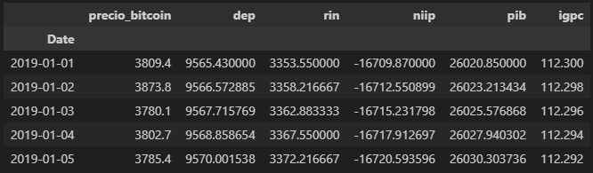  

- Limpieza de datos  

    - Valores faltantes: 
    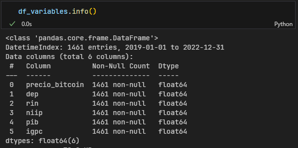
    - Filas duplicadas: 
    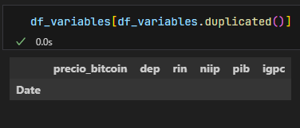
    - Valores atípicos: 
    

- Estadísticos:  
    - Gráficas lineales:
        Precio historico del bitcoin: 
        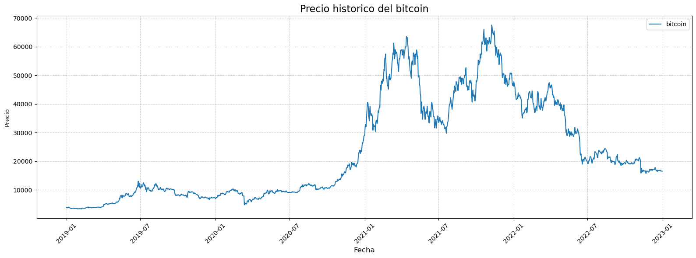 
        Reservas internacionales netas: 
        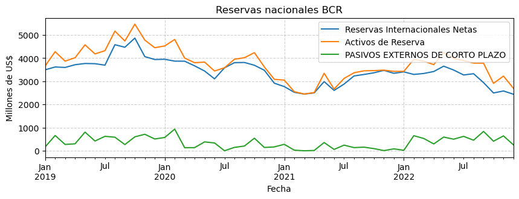 
        Posición de inversión internacional neta: 
        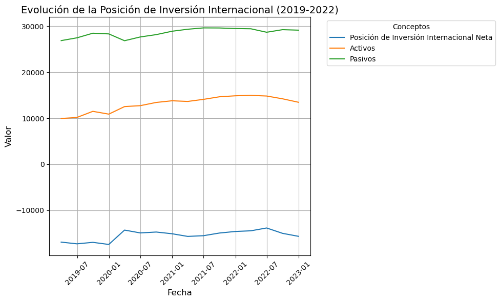 
        Producto interno bruto: 
        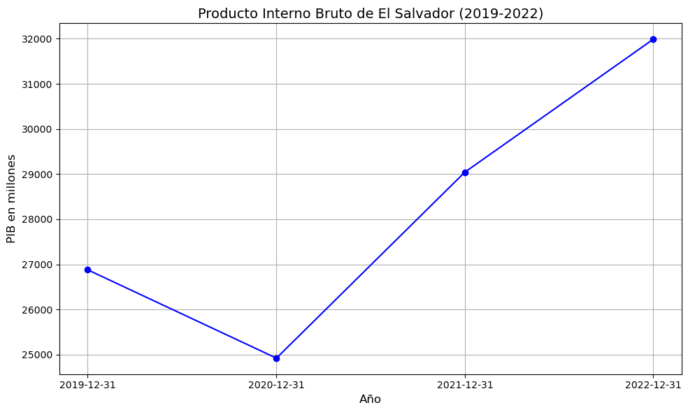 
        Índice de precios al consumidor: 
        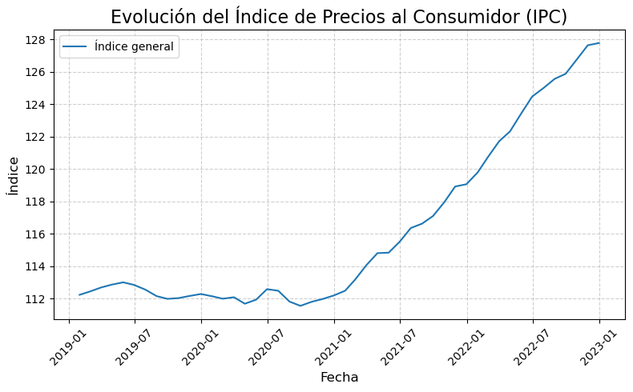 
        Deusa externa pública: 
        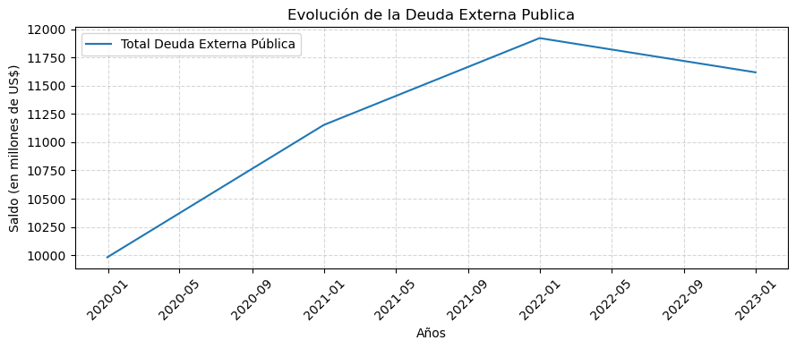  
    - Gráficas de puntos e historigrama (pairplot) 
        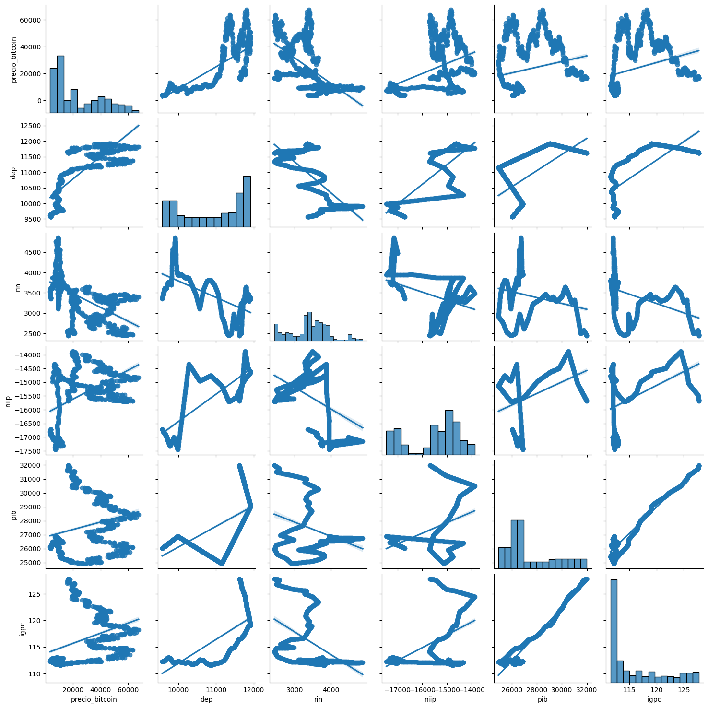  
    - Análisis de normalidad de los datos: 
        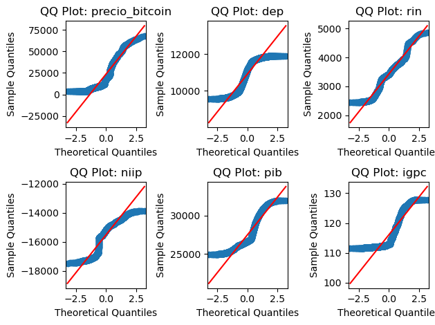  
    - Correlación de los datos 
        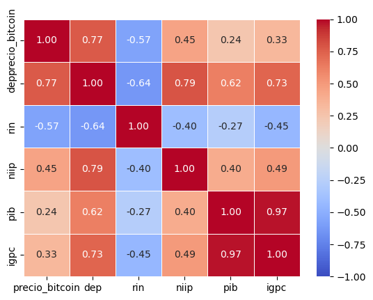  

## Funcionalidades extra:

### Blog informativo
#### Descripción

Esta funcionalidad extra consta de una página web a modo de blog informativo, donde se muestra nuestro análisis, su imoprtancia, bajo que contexto se hace, y las conclusiones. También explicamos cada variable usada para el análisis

#### Herramientas usadas:
- html
- css
- javascript

## Estado del proyecto

El proyecto se encuentra finalizado

## Agradecimientos

Queremos agradecer a todas las personas y organizaciones que han contribuido al desarrollo de este proyecto:

- A nuestro equipo de desarrollo por su dedicación y esfuerzo.
- A nuestros mentores y asesores por su valiosa orientación.
- A la comunidad de código abierto por las herramientas y recursos proporcionados.
- A Samsung Innovation Campus por darnos la oportunidad de educarnos y presentar este proyecto.

Gracias a todos por su apoyo y colaboración.
